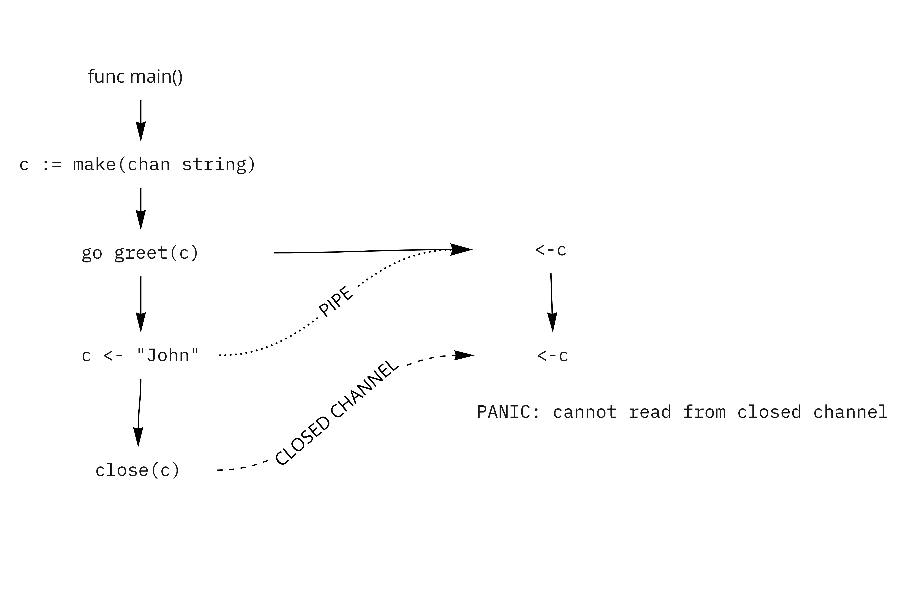

### What happens in channel.go

Channels are an construct for passing message between go routines and are a way to synchronize the go routines. This construct is used to acheive concurrency in go which is not same as parallelism in go. Concurrent programs can be later converted into parallel programs.  

- when go routine `greet` is called it creates a routine and inside the routine `<-c` we are taking stuff out from channel but the channel is empty so the go routine waits for the channel to be filled.

- Simultaneously when `c <- "John"` we put stuff into channel the waiting go routine is woke up by scheduler and we can take out from channel. and in the second line when again we want to remove from channel nothing is present in the channel so, it again goes in waiting.

- In main go routine, we now close the channel. Since the channel is closed the waiting go routines cannot take out from the channel so panic is thrown by the program and the program terminates.

