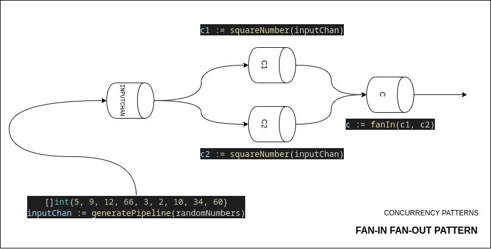

### Fan-In Fan-Out pattern

Each instance of `squareNumber` reads from same input and divide the channels into two channels (de multiplexing) and then `fanIn` will join multiple channel output into single channel. After which we can loop through the channel to get the squared number output.

#### Difference between <-chan and chan in return type [stack-overflow](https://stackoverflow.com/questions/31920353/whats-the-difference-between-chan-and-chan-as-a-function-return-type)

- Arrow pointing away `<-chan` means that the channel is read only i.e data can only be pulled from by the code. (No Pushing Allowed)

- Arrow pointing towards `chan<-` means that data can only be pushed to channel not popped. (No Taking Out, Only Putting)

- Only `chan` will support both read and write. 
