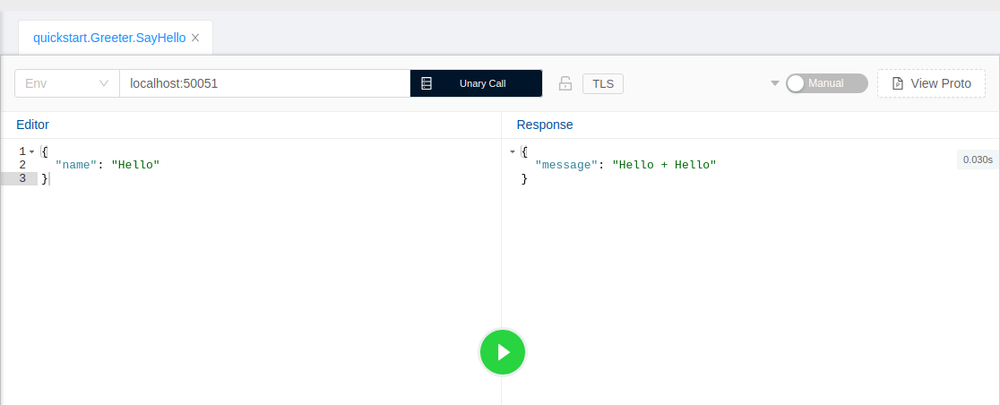

### GRPC SAMPLE PROJECT USING GO 

For checking if the grpc server actually works we can use `BloomGRPC` software to test the request and response. 



The output of request and response is shown in the figure above.

##### PROBLEM
- Not found `protoc-gen-go-grpc` following error message is shown when compiling the file.
    ```
    protoc-gen-go-grpc: program not found or is not executable
    Please specify a program using absolute path or make sure the program is available in your PATH system variable
    --go-grpc_out: protoc-gen-go-grpc: Plugin failed with status code 1.
    ```
    from the documentation the package `protoc-gen-go-grpc` is under the plan to be phased out and merged with `protoc-gen-go` so, for the timebeing we need to run :

    ```
    go get google.golang.org/grpc/cmd/protoc-gen-go-grpc 
    ```

    to compile protobuff files.